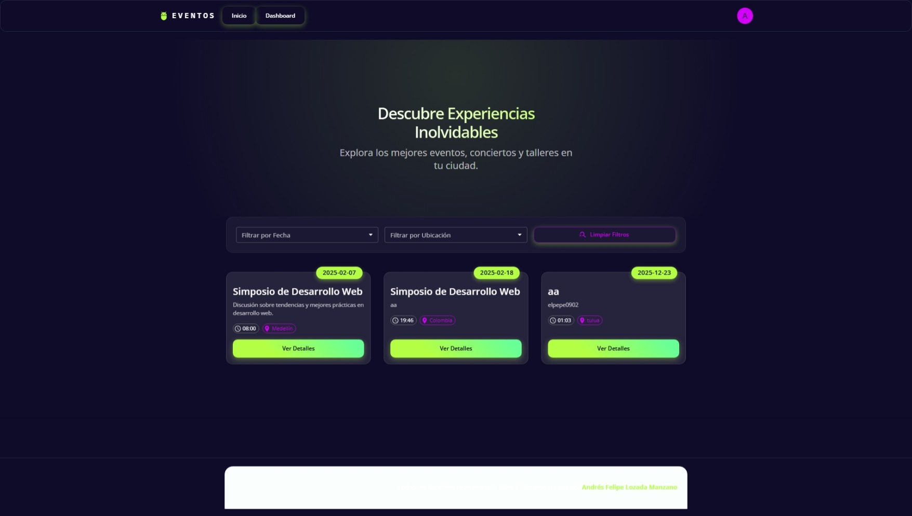

# Proyecto de Autenticación y CRUD con React y Node.js

Este proyecto es una aplicación web que permite a los usuarios registrarse, iniciar sesión y administrar eventos a través de un CRUD. Utiliza un backend en Node.js con Express y MongoDB, y un frontend en React.

### Vista Previa

| Página de Inicio | Panel Administrativo |
| :---: | :---: |
|  |  |


## Tecnologías Utilizadas

- **Frontend:** React, React Router, SweetAlert2, Axios, Material UI, Framer Motion
- **Backend:** Node.js, Express, Mongoose, bcryptjs, jsonwebtoken, dotenv
- **Base de Datos:** MongoDB

## Enlace al video

Puedes ver un video demostrativo del proyecto en el siguiente enlace: https://youtu.be/IyEfGd1T09Q?si=N-HIjXlcQPETZoH9

## Instalación

### Requisitos Previos

Antes de comenzar, asegúrate de tener instalado:

- [Node.js](https://nodejs.org/)
- [MongoDB](https://www.mongodb.com/)

## Instalación del Backend

```bash
cd backend
npm init -y
npm install express mongoose cors dotenv bcryptjs jsonwebtoken
```

### Configuración del Backend

Crea un archivo `.env` en la carpeta `backend` y agrega las siguientes variables de entorno:

```
MONGODB_URI=tu_conexion_a_mongodb
JWT_SECRET=una_clave_secreta_segura
PORT=5000
```

Ejecutar el backend:

```bash
node index.js
```

## Instalación del Frontend

```bash
cd frontend
npm create vite@latest . -- --template react
npm install
npm install sweetalert2 axios react-router-dom
```

Ejecutar el frontend:

```bash
npm run dev
```

## Uso

- Accede a http://localhost:5173/ para ver la interfaz.
- **Registro y Login:** Los usuarios pueden registrarse y autenticarse.
- **Administración de Eventos:** Se pueden agregar, modificar y eliminar eventos.
- **Roles de Usuario:** Se asigna el primer usuario como administrador.
- **Filtro:** Puedes filtrar eventos por fecha y ubicación.

## Estructura del Proyecto

```

/
backend
│── index.js
│── info backend.txt
│── package-lock.json
│── package.json
│
frontend
│── node_modules/
│── public/
│── src
│   │── assets/
│   │── components
│   │   │── Footer.jsx
│   │   │── NavBar.jsx
│   │── pages
│   │   │── Dashboard.jsx
│   │   │── Home.jsx
│   │   │── Login.jsx
│   │   │── Register.jsx
│   │── service
│   │   │── itemService.js
│   │── App.css
│   │── App.jsx
│   │── AppCopia.jsx
│   │── index.css
│   │── info frontend.txt
│   │── main.jsx
│── .gitignore
│── eslint.config.js
│── index.html

```
## Autor

Desarrollado por Andrés Felpe Lozada Manzano


